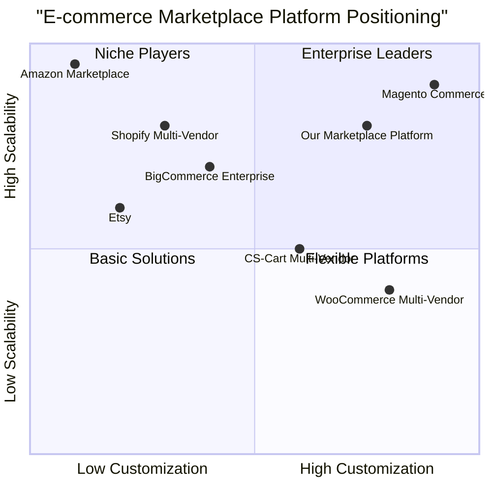
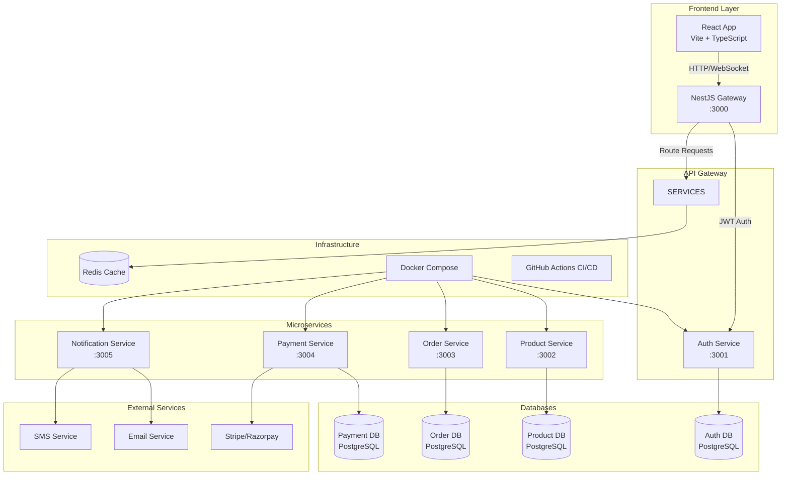

# Product Requirements Document (PRD)
# Marketplace - Multi-Vendor E-commerce Platform

## 1. Language & Project Information

**Language:** English  
**Programming Languages:** TypeScript, React 18, NestJS  
**Frontend Framework:** React 18 + Vite + TypeScript with TailwindCSS + shadcn/ui  
**Backend Framework:** NestJS Microservices Architecture  
**Database:** PostgreSQL with Prisma ORM  
**Project Name:** marketplace  

### Original Requirements Restatement
Create a production-ready monorepo project called "Marketplace" featuring:
- Monorepo structure with React frontend and NestJS microservices backend
- Multi-role system supporting buyers, vendors, and administrators
- Complete e-commerce functionality including product browsing, cart management, checkout, and order processing
- Microservices architecture with API Gateway, Authentication, Product, Order, Payment, and Notification services
- Modern tech stack with React 18, Vite, TypeScript, NestJS, Prisma, PostgreSQL, and Docker
- Payment integration with Razorpay/Stripe, real-time notifications via Socket.IO
- Infrastructure setup with Docker Compose and CI/CD pipeline using GitHub Actions
- Deployment strategy: Backend on Render, Frontend on Vercel

## 2. Product Definition

### 2.1 Product Goals

1. **Scalable Multi-Vendor Platform**: Create a robust, production-ready marketplace that can efficiently handle multiple vendors, thousands of products, and concurrent users while maintaining high performance and reliability.

2. **Seamless User Experience**: Deliver an intuitive, responsive, and engaging shopping experience across all user roles (buyers, vendors, admins) with real-time updates, smooth navigation, and comprehensive functionality.

3. **Developer-Friendly Architecture**: Implement a maintainable, well-documented monorepo with microservices architecture that enables rapid feature development, easy testing, and seamless deployment processes.

### 2.2 User Stories

#### Buyer Stories
- **As a buyer**, I want to browse products with advanced filtering and search capabilities so that I can quickly find items that match my preferences and budget.
- **As a buyer**, I want to add products to my cart and proceed through a secure checkout process so that I can purchase items safely and efficiently.
- **As a buyer**, I want to track my order status in real-time and receive notifications about order updates so that I stay informed about my purchases.
- **As a buyer**, I want to view my order history and manage my account details so that I can keep track of my shopping activity and personal information.

#### Vendor Stories
- **As a vendor**, I want to register and create a vendor profile so that I can start selling my products on the marketplace after admin approval.
- **As a vendor**, I want to manage my product catalog (add, edit, delete products) with variants and inventory tracking so that I can maintain accurate product information and availability.
- **As a vendor**, I want to view and manage incoming orders with status updates so that I can fulfill customer orders efficiently and maintain good customer relationships.
- **As a vendor**, I want to access analytics and reports about my sales performance so that I can make data-driven decisions to grow my business.

#### Administrator Stories
- **As an administrator**, I want to approve or reject vendor applications so that I can maintain quality control over marketplace participants.
- **As an administrator**, I want to manage product categories and oversee the overall marketplace operations so that I can ensure a well-organized and functional platform.
- **As an administrator**, I want to monitor system performance, user activities, and resolve disputes so that I can maintain a healthy marketplace ecosystem.

### 2.3 Competitive Analysis

#### Direct Competitors

1. **Shopify Multi-Vendor**
   - **Pros**: Established ecosystem, extensive app marketplace, strong payment processing, excellent SEO tools
   - **Cons**: High transaction fees, limited customization without apps, expensive for small vendors

2. **WooCommerce Multi-Vendor**
   - **Pros**: Open-source flexibility, extensive customization options, large community support, cost-effective
   - **Cons**: Requires technical expertise, performance issues with scale, security responsibility on user

3. **Magento Commerce**
   - **Pros**: Enterprise-grade features, highly customizable, strong B2B capabilities, robust inventory management
   - **Cons**: Complex setup and maintenance, high resource requirements, steep learning curve

4. **Amazon Marketplace**
   - **Pros**: Massive customer base, established trust, comprehensive logistics, advanced analytics
   - **Cons**: High competition, strict policies, limited branding opportunities, high fees

5. **Etsy**
   - **Pros**: Niche focus on handmade/vintage, strong community, built-in marketing tools, mobile-optimized
   - **Cons**: Limited to specific product categories, high competition, limited customization

#### Indirect Competitors

6. **BigCommerce Enterprise**
   - **Pros**: Built-in multi-vendor capabilities, strong API, good performance, comprehensive features
   - **Cons**: Limited design flexibility, transaction fees on lower plans, fewer third-party integrations

7. **CS-Cart Multi-Vendor**
   - **Pros**: Dedicated multi-vendor solution, white-label options, comprehensive vendor management
   - **Cons**: Limited market presence, fewer integrations, requires technical setup

### 2.4 Competitive Quadrant Chart



## 3. Technical Specifications

### 3.1 Requirements Analysis

The Marketplace platform requires a comprehensive technical architecture that supports:

**Frontend Requirements:**
- Modern React 18 application with TypeScript for type safety
- Responsive design using TailwindCSS and shadcn/ui component library
- State management with React Query for server state and local state management
- Form handling with react-hook-form and Zod validation
- Real-time updates via Socket.IO integration
- Optimistic UI updates for enhanced user experience

**Backend Requirements:**
- Microservices architecture using NestJS framework
- PostgreSQL databases with Prisma ORM for each service
- JWT-based authentication with refresh token mechanism
- RESTful APIs with proper error handling and validation
- Inter-service communication via gRPC or message brokers
- Payment processing integration with Stripe/Razorpay
- Real-time notification system

**Infrastructure Requirements:**
- Docker containerization for all services
- Docker Compose for local development environment
- CI/CD pipeline with GitHub Actions
- Environment configuration management
- Database migration and seeding scripts
- Monitoring and logging capabilities

### 3.2 Requirements Pool

#### P0 Requirements (Must-Have)
- **AUTH-001**: User registration and authentication system with JWT tokens
- **AUTH-002**: Role-based access control (buyer, vendor, admin)
- **PROD-001**: Product catalog management with CRUD operations
- **PROD-002**: Product search and filtering capabilities
- **CART-001**: Shopping cart functionality with add/remove/update operations
- **ORDER-001**: Order creation and management system
- **ORDER-002**: Order status tracking and updates
- **PAY-001**: Payment processing integration (Stripe/Razorpay test mode)
- **VENDOR-001**: Vendor registration and approval workflow
- **ADMIN-001**: Admin dashboard for marketplace management
- **INFRA-001**: Docker containerization and Docker Compose setup
- **INFRA-002**: Database schema design and migrations

#### P1 Requirements (Should-Have)
- **NOTIF-001**: Real-time notifications via Socket.IO
- **NOTIF-002**: Email notifications for order updates
- **PROD-003**: Product variants and inventory management
- **ANALYTICS-001**: Basic analytics dashboard for vendors
- **SEARCH-001**: Advanced product search with filters
- **UI-001**: Responsive design across all devices
- **TEST-001**: Unit and integration test coverage
- **DEPLOY-001**: CI/CD pipeline with GitHub Actions
- **DEPLOY-002**: Production deployment on Render and Vercel

#### P2 Requirements (Nice-to-Have)
- **NOTIF-003**: SMS notifications via Twilio
- **ANALYTICS-002**: Advanced analytics and reporting
- **SOCIAL-001**: Social media integration
- **REVIEW-001**: Product reviews and ratings system
- **WISHLIST-001**: User wishlist functionality
- **COUPON-001**: Discount and coupon system
- **CHAT-001**: In-app messaging between buyers and vendors
- **API-001**: Public API for third-party integrations

### 3.3 UI Design Draft

#### Layout Structure
```
┌─────────────────────────────────────────────────────────┐
│                    Navigation Bar                        │
│  Logo    [Search Bar]    Cart(0)  Profile  Login/Logout │
├─────────────────────────────────────────────────────────┤
│                                                         │
│  ┌─────────────┐  ┌─────────────────────────────────┐   │
│  │   Sidebar   │  │        Main Content Area        │   │
│  │             │  │                                 │   │
│  │ Categories  │  │  Product Grid / Details /       │   │
│  │ Filters     │  │  Cart / Dashboard               │   │
│  │ Price Range │  │                                 │   │
│  │             │  │                                 │   │
│  └─────────────┘  └─────────────────────────────────┘   │
│                                                         │
├─────────────────────────────────────────────────────────┤
│                       Footer                            │
│         Links    Support    Social Media                │
└─────────────────────────────────────────────────────────┘
```

#### Key Components
- **ProductCard**: Image, title, price, vendor, add to cart button
- **ProductGrid**: Responsive grid layout with pagination
- **FilterSidebar**: Category, price range, brand, rating filters
- **ShoppingCart**: Item list, quantity controls, total calculation
- **CheckoutForm**: Shipping details, payment method selection
- **OrderTracker**: Progress indicator with status updates
- **VendorDashboard**: Sales metrics, product management, order fulfillment
- **AdminPanel**: User management, vendor approvals, system settings

#### User Flows
1. **Product Discovery**: Home → Category → Product List → Product Details → Add to Cart
2. **Purchase Flow**: Cart → Checkout → Payment → Order Confirmation → Order Tracking
3. **Vendor Management**: Vendor Dashboard → Add Product → Manage Inventory → Process Orders
4. **Admin Operations**: Admin Panel → Approve Vendors → Manage Categories → Monitor System

### 3.4 Architecture Diagram



### 3.5 Database Schema Design

#### Auth Service Schema
```sql
-- Users table
CREATE TABLE users (
    id UUID PRIMARY KEY DEFAULT gen_random_uuid(),
    email VARCHAR(255) UNIQUE NOT NULL,
    password_hash VARCHAR(255) NOT NULL,
    name VARCHAR(255) NOT NULL,
    role user_role NOT NULL DEFAULT 'buyer',
    is_active BOOLEAN DEFAULT true,
    email_verified BOOLEAN DEFAULT false,
    created_at TIMESTAMP DEFAULT NOW(),
    updated_at TIMESTAMP DEFAULT NOW()
);

-- Refresh tokens table
CREATE TABLE refresh_tokens (
    id UUID PRIMARY KEY DEFAULT gen_random_uuid(),
    user_id UUID REFERENCES users(id) ON DELETE CASCADE,
    token VARCHAR(500) NOT NULL,
    expires_at TIMESTAMP NOT NULL,
    created_at TIMESTAMP DEFAULT NOW()
);
```

#### Product Service Schema
```sql
-- Vendors table
CREATE TABLE vendors (
    id UUID PRIMARY KEY DEFAULT gen_random_uuid(),
    user_id UUID NOT NULL,
    business_name VARCHAR(255) NOT NULL,
    description TEXT,
    status vendor_status DEFAULT 'pending',
    created_at TIMESTAMP DEFAULT NOW(),
    updated_at TIMESTAMP DEFAULT NOW()
);

-- Categories table
CREATE TABLE categories (
    id UUID PRIMARY KEY DEFAULT gen_random_uuid(),
    name VARCHAR(255) NOT NULL,
    slug VARCHAR(255) UNIQUE NOT NULL,
    parent_id UUID REFERENCES categories(id),
    created_at TIMESTAMP DEFAULT NOW()
);

-- Products table
CREATE TABLE products (
    id UUID PRIMARY KEY DEFAULT gen_random_uuid(),
    vendor_id UUID REFERENCES vendors(id) ON DELETE CASCADE,
    category_id UUID REFERENCES categories(id),
    name VARCHAR(255) NOT NULL,
    description TEXT,
    price DECIMAL(10,2) NOT NULL,
    stock_quantity INTEGER DEFAULT 0,
    is_active BOOLEAN DEFAULT true,
    created_at TIMESTAMP DEFAULT NOW(),
    updated_at TIMESTAMP DEFAULT NOW()
);
```

### 3.6 API Specifications

#### Authentication Endpoints
```typescript
// Auth Service API
POST /auth/register
POST /auth/login
POST /auth/refresh
POST /auth/logout
GET  /auth/profile
PUT  /auth/profile
```

#### Product Endpoints
```typescript
// Product Service API
GET    /products              // List products with filters
GET    /products/:id          // Get product details
POST   /vendor/products       // Create product (vendor only)
PUT    /vendor/products/:id   // Update product (vendor only)
DELETE /vendor/products/:id   // Delete product (vendor only)
GET    /categories            // List categories
```

#### Order Endpoints
```typescript
// Order Service API
GET    /cart                  // Get user's cart
POST   /cart/items           // Add item to cart
PUT    /cart/items/:id       // Update cart item
DELETE /cart/items/:id       // Remove cart item
POST   /checkout             // Create order from cart
GET    /orders               // List user's orders
GET    /orders/:id           // Get order details
PUT    /orders/:id/status    // Update order status (vendor/admin)
```

### 3.7 Security Requirements

- **Authentication**: JWT tokens with refresh token rotation
- **Authorization**: Role-based access control (RBAC)
- **Data Validation**: Input validation using Zod schemas
- **Password Security**: bcrypt hashing with salt rounds
- **HTTPS**: SSL/TLS encryption for all communications
- **CORS**: Properly configured CORS policies
- **Rate Limiting**: API rate limiting to prevent abuse
- **SQL Injection**: Parameterized queries via Prisma ORM
- **XSS Protection**: Content Security Policy headers

### 3.8 Performance Requirements

- **Response Time**: API responses under 200ms for 95% of requests
- **Throughput**: Support 1000+ concurrent users
- **Database**: Query optimization with proper indexing
- **Caching**: Redis caching for frequently accessed data
- **CDN**: Static asset delivery via CDN
- **Code Splitting**: Lazy loading for React components
- **Image Optimization**: WebP format with multiple sizes
- **Bundle Size**: Frontend bundle under 1MB gzipped

### 3.9 Open Questions

1. **Payment Processing**: Should we implement wallet functionality for vendors to manage earnings, or rely solely on direct payment processing?

2. **Inventory Management**: How should we handle inventory synchronization across multiple sales channels if vendors sell on other platforms?

3. **Shipping Integration**: Should we integrate with shipping providers (FedEx, UPS) for real-time shipping rates and tracking?

4. **Multi-tenancy**: Should we support white-label solutions where clients can customize branding and domain?

5. **Internationalization**: What level of multi-language and multi-currency support is required for the initial release?

6. **Mobile Applications**: Is there a requirement for native mobile apps (iOS/Android) in addition to the responsive web application?

7. **Data Analytics**: What level of business intelligence and analytics should be provided to vendors and administrators?

8. **Compliance**: Are there specific regulatory compliance requirements (GDPR, PCI DSS) that need to be addressed?

9. **Scalability**: What are the expected growth projections and should we plan for horizontal scaling from the beginning?

10. **Third-party Integrations**: Which third-party services (CRM, email marketing, accounting) should have built-in integrations?

## 4. Implementation Roadmap

### Phase 1: Foundation (Weeks 1-4)
- Set up monorepo structure and development environment
- Implement authentication service with JWT
- Create basic user registration and login functionality
- Set up database schemas and migrations
- Implement API Gateway with basic routing

### Phase 2: Core Features (Weeks 5-8)
- Develop product service with CRUD operations
- Implement shopping cart functionality
- Create order management system
- Build basic frontend with React and TailwindCSS
- Integrate payment processing (test mode)

### Phase 3: User Experience (Weeks 9-12)
- Implement vendor dashboard and product management
- Create admin panel for marketplace management
- Add real-time notifications via Socket.IO
- Develop responsive UI components
- Implement search and filtering capabilities

### Phase 4: Polish & Deploy (Weeks 13-16)
- Add comprehensive testing (unit, integration, e2e)
- Implement CI/CD pipeline with GitHub Actions
- Set up monitoring and logging
- Performance optimization and security hardening
- Production deployment and documentation

### Phase 5: Enhancement (Weeks 17-20)
- Advanced analytics and reporting
- Mobile optimization improvements
- Additional payment methods and features
- Third-party integrations
- User feedback implementation and iteration

---

*This PRD serves as the comprehensive guide for developing the Marketplace platform. Regular reviews and updates should be conducted as the project progresses and requirements evolve.*